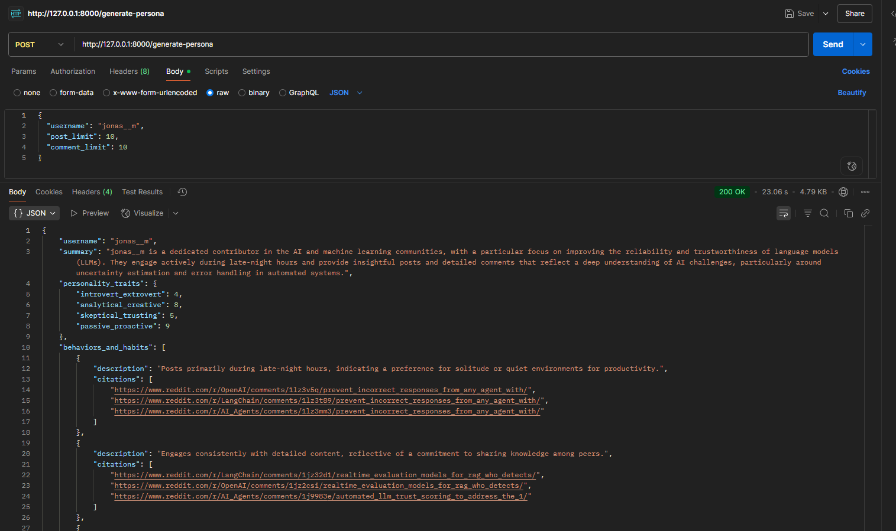

# Reddit User Persona Generator

An AI-powered tool to create detailed, data-driven user personas from Reddit profiles. This project leverages Large Language Models (LLMs) to analyze a user's posts and comments, generating insights into their personality, interests, and online behavior. The tool is available as both a command-line interface (CLI) and a REST API.

**Simple Demo**

[https://github.com/user-attachments/assets/c59be406-1e4e-45c4-9205-ecaa67e36cbc](https://github.com/user-attachments/assets/c59be406-1e4e-45c4-9205-ecaa67e36cbc) 

---

## 📌 Key Features

*   **AI Based Analysis**: Utilizes LLMs via **LiteLLM** for intelligent persona generation, making it compatible with various models (OpenAI, Claude, Gemini, etc.).
*   **Data-Driven with Citations**: Every insight (e.g., interests, frustrations) is backed by citations, linking directly to the source post or comment.
*   **Dual Output Modes**: Generate personas as either structured **JSON** (for machine readability) or clean **Markdown** (for human readability).
*   **Robust & Modular Architecture**: The codebase is cleanly separated into modules for scraping, data processing, and persona building, following best software practices.
*   **RESTful API**: A **FastAPI** application serves the persona generation logic, complete with interactive Swagger UI documentation.
*   **Configurable & Easy to Use**: Configurable via a `.env` file for API keys and a CLI for custom generation tasks.

---

## 📱 Tech Stack

*   **Backend**: Python, FastAPI
*   **Reddit API**: PRAW (Python Reddit API Wrapper)
*   **LLM Integration**: LiteLLM
*   **Data Validation**: Pydantic
*   **Configuration**: Dotenv, PyYAML
*   **API Server**: Uvicorn

---

## ⚙️ Setup and Installation

Follow these steps to set up and run the project locally.

**1. Clone the Repository**
```bash
git clone https://github.com/ananya868/Reddit-User-Persona-Generator.git
cd Reddit-User-Persona-Generator
```

**2. Create and Activate a Virtual Environment**
It's highly recommended to use a virtual environment to manage dependencies.

*   Using `venv`:
    ```bash
    python -m venv venv
    # On Windows
    venv\Scripts\activate
    # On macOS/Linux
    source venv/bin/activate
    ```
*   Using `conda`:
    ```bash
    conda create -n persona_env python=3.11
    conda activate persona_env
    ```

**3. Install Dependencies**
```bash
pip install -r requirements.txt
```

**4. Configure Environment Variables**
Create a `.env` file in the project root by copying the example file.

```bash
# On Windows
copy .env.example .env
# On macOS/Linux
cp .env.example .env
```
Now, open the `.env` file and add your API credentials:
```env
# Reddit API Credentials
REDDIT_CLIENT_ID="your_reddit_client_id"
REDDIT_CLIENT_SECRET="your_reddit_client_secret"

# LLM Configuration (using OpenAI as an example)
LLM_MODEL="gpt-4o-mini"
OPENAI_API_KEY="sk-..."
```

**NOTE: Please install provider specific client library as well if required. Example - google, anthropic, etc.**
**For this project, I used OpenAI!**

---

## 🧺 Usage

You can interact with this project in two ways:

### 1. Command-Line Interface (CLI)

Use the `run.py` script for flexible, one-off persona generation.

**Generate a Markdown persona:**
```bash
python run.py --username kojied --post-limit 10 --comment-limit 20
```

**Generate a structured JSON persona:**
```bash
python run.py --username kojied -pl 50 -cl 100 --mode json
```

### 2. FastAPI Application

Launch the web server to use the API (api.py):

**1. Start the Server**
```bash
uvicorn api:app --reload
```

**2. Access the Interactive API Docs**
Once the server is running, open your browser and navigate to:
**[http://127.0.0.1:8000/docs](http://127.0.0.1:8000/docs)**

From the Swagger UI, you can directly test the `/generate-persona` endpoint.

**3. Use with cURL**
You can also interact with the API programmatically:
```bash
curl -X 'POST' \
  'http://127.0.0.1:8000/generate-persona' \
  -H 'Content-Type: application/json' \
  -d '{
    "username": "kojied",
    "post_limit": 15,
    "comment_limit": 30
  }'
```

**4. Test with PostMan**
You can also try the api using PostMan: 

 

---

## ⛩️ Project Architecture

The project is structured with a clear separation of concerns, making it scalable and easy to maintain.

```
/reddit-user-persona-generator/
|
|-- api.py                    # FastAPI application entry point
|-- run.py                    # Command-line interface (CLI) entry point
|
|-- /src/
|   |-- scraper.py             # Module for scraping Reddit data
|   |-- data_processor.py      # Module for cleaning and analyzing scraped data
|   |-- persona_builder.py     # Module for orchestrating LLM calls and prompt formatting
|   |-- /utils/
|       |-- llm_client.py      # Reusable client for LiteLLM
|       |-- /schemas/
|           |-- persona_schema.py # Pydantic schema for the final persona
|       |-- /prompts/
|           |-- structured_prompt.yml # Prompt for generating JSON
|           |-- standard_prompt.yml   # Prompt for generating Markdown
|
|-- /data/                     # Directory for saved raw data logs
|-- /output/                   # Directory for generated persona files
|
|-- .env.example               # Example environment file
|-- requirements.txt           # Project dependencies
|-- README.md                  # This file
```

---

## 🔮 Sample Persona Output

The API and structured CLI mode generate a detailed JSON object. Here is a sample of the output:

<details>
<summary>Click to see a sample JSON persona</summary>

```json
{
  "username": "test_user_final",
  "summary": "This user appears to be a forward-thinking individual with a strong interest in the intersection of technology and society, particularly concerning AI ethics and regulation. They are proactive in discussions, often taking a stance on complex issues. They also offer practical, cautious advice in other domains like personal finance, suggesting a well-rounded and analytical mindset.",
  "personality_traits": {
    "introvert_extrovert": 7,
    "analytical_creative": 3,
    "skeptical_trusting": 4,
    "passive_proactive": 9
  },
  "behaviors_and_habits": [
    {
      "description": "Prefers to initiate discussions on complex or serious topics.",
      "citations": [
        "http://reddit.com/r/Futurology/p1"
      ]
    },
    {
      "description": "Engages in discussions to reinforce and agree with points made by others.",
      "citations": [
        "http://reddit.com/r/Futurology/p1/c1"
      ]
    }
  ],
  "topics_of_interest": [
    {
      "description": "AI Ethics and Regulation: The user expresses strong opinions on the importance of safely managing artificial intelligence.",
      "citations": [
        "http://reddit.com/r/Futurology/p1",
        "http://reddit.com/r/Futurology/p1/c1"
      ]
    },
    {
      "description": "Personal Finance: The user advises on long-term, safe investment strategies, specifically low-cost index funds.",
      "citations": [
        "http://reddit.com/r/PersonalFinance/p2/c2"
      ]
    }
  ],
  "motivations_and_values": [
    {
      "description": "Values proactive and safe technological development.",
      "citations": [
        "http://reddit.com/r/Futurology/p1"
      ]
    },
    {
      "description": "Motivated by helping others make prudent financial decisions.",
      "citations": [
        "http://reddit.com/r/PersonalFinance/p2/c2"
      ]
    }
  ],
  "frustrations_and_pain_points": [
    {
      "description": "Frustrated by risky, short-sighted approaches to complex problems like market timing.",
      "citations": [
        "http://reddit.com/r/PersonalFinance/p2/c2"
      ]
    }
  ]
}
```

</details>
